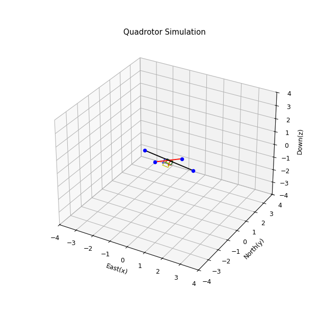

# Quadrotor Trajectory Control using LQR

[](https://colab.research.google.com/github/jan-1995/Trajectory_Ctrl_LQR/blob/main/TRAJECTORY_CONTROL_QC.ipynb)

## Overview

This project implements a **Linear Quadratic Regulator (LQR) control system** for quadrotor trajectory tracking. The system combines two hierarchical LQR controllers - one for attitude control and another for position/trajectory control, enabling precise 3D trajectory following with excellent disturbance rejection.

## Key Features

- **Hierarchical LQR Control Architecture**
  - Attitude LQR Controller (Inner Loop)
  - Trajectory LQR Controller (Outer Loop)
- **3D Trajectory Generation** with multiple pre-configured patterns
- **Real-time 3D Visualization** of quadrotor flight
- **Comprehensive State Analysis** with error plots
- **Sensor Noise Simulation** (Accelerometer and Gyroscope)
- **Animated GIF Export** for presentations and documentation

## What This Simulation Does

### Trajectory Patterns
The simulation includes several pre-defined trajectory patterns:
- **Condition 1**: Large amplitude figure-8 pattern
- **Condition 2**: Medium amplitude elliptical path *(currently active)*
- **Condition 3**: Symmetric figure-8 pattern
- **Custom**: User-definable trajectory parameters

### Control System Architecture

```
Reference Trajectory → [Trajectory LQR] → Attitude Commands → [Attitude LQR] → Motor Commands → Quadrotor
                                   ↑                                ↑
                             Position Feedback                Attitude Feedback
```

## Getting Started

### Prerequisites

```bash
pip install numpy scipy matplotlib jupyter pillow
```

### Installation & Usage

1. **Clone the repository**
   ```bash
   git clone https://github.com/jan-1995/Trajectory_Ctrl_LQR.git
   cd Trajectory_Ctrl_LQR
   ```

2. **Open the Jupyter Notebook**
   ```bash
   jupyter notebook TRAJECTORY_CONTROL_QC.ipynb
   ```

3. **Run All Cells**
   - Execute each cell in sequence
   - The simulation will generate:
     - 3D animated visualization
     - State plots with reference tracking
     - Error analysis plots
     - Animation GIF file (`quadrotor_animation.gif`)

## Simulation Results

### 3D Trajectory Visualization
The simulation produces a real-time 3D animation showing:
- **Quadrotor model** with arms and rotors
- **Actual trajectory** (green dotted line)
- **Reference trajectory** (red dotted line)
- **3D coordinate system** (East, North, Down)



### State Analysis Plots
Comprehensive analysis including:
- Position tracking (North, East, Down)
- Velocity profiles
- Attitude angles (Roll, Pitch, Yaw) with commanded values
- Angular rates
- Control errors and convergence

## Technical Details

### System Parameters
- **Mass**: 1.56 kg
- **Moments of Inertia**:
  - Jx = 0.1147 kg⋅m²
  - Jy = 0.0576 kg⋅m²
  - Jz = 0.1712 kg⋅m²

### Control Design
- **Simulation Time**: 15 seconds
- **Time Step**: 0.05 seconds
- **LQR Weight Matrices**: Optimized for trajectory tracking and control effort

### State Vector
```
x = [pn, pe, pd, u, v, w, φ, θ, ψ, p, q, r]
```
Where:
- `pn, pe, pd`: Position (North, East, Down)
- `u, v, w`: Linear velocities
- `φ, θ, ψ`: Euler angles (Roll, Pitch, Yaw)
- `p, q, r`: Angular rates

## Customization

### Modify Trajectory Parameters
In the `trajectory()` function, adjust:
```python
# Trajectory parameters
a = 1.5      # X-axis amplitude
b = 0.75     # Y-axis amplitude  
c = 0.5      # Z-axis amplitude
n = -0.75    # Z-axis offset
T = 10       # Period (seconds)
```

### Tune LQR Controllers
Modify Q and R matrices in:
- `attitude_LQR()` - for attitude control tuning
- `trajectory_LQR()` - for position control tuning

### Simulation Settings
```python
Tfinal = 15    # Simulation duration
dt = 0.05      # Time step
frames = 300   # Animation frames
```

## Performance Metrics

The simulation provides detailed analysis of:
- **Tracking Error**: Position and attitude error convergence
- **Control Effort**: Thrust and torque commands
- **Noise Rejection**: Response to sensor noise
- **Stability**: System stability margins

## Project Structure

```
Trajectory_Ctrl_LQR/
├── TRAJECTORY_CONTROL_QC.ipynb    # Main simulation notebook
├── README.md                       # This documentation
├── LICENSE                         # Project license
└── quadrotor_animation.gif         # Generated animation (after run)
```

## Theory & Background

This implementation demonstrates:
- **LQR Optimal Control** for multivariable systems
- **Hierarchical Control** architecture design
- **Trajectory Generation** for UAV applications
- **3D Dynamics** and control of quadrotor systems
- **State-space Control** design methodology

## References

- Linear Quadratic Regulator (LQR) Theory
- Quadrotor Dynamics and Control
- Optimal Control Theory
- Modern Control Systems

## Contributing

Contributions are welcome! Please feel free to submit a Pull Request.

## License

This project is licensed under the MIT License - see the [LICENSE](LICENSE) file for details.

## Author

**Haider Jan**
- GitHub: [@jan-1995](https://github.com/jan-1995)
- LinkedIn: [Connect with me](https://linkedin.com/in/your-profile)

---

### Note
This simulation demonstrates smooth 3D trajectory generation while maintaining stable flight control - an excellent resource for understanding how modern drones achieve precise autonomous flight.

If you found this project helpful, please consider giving it a star.
